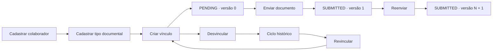
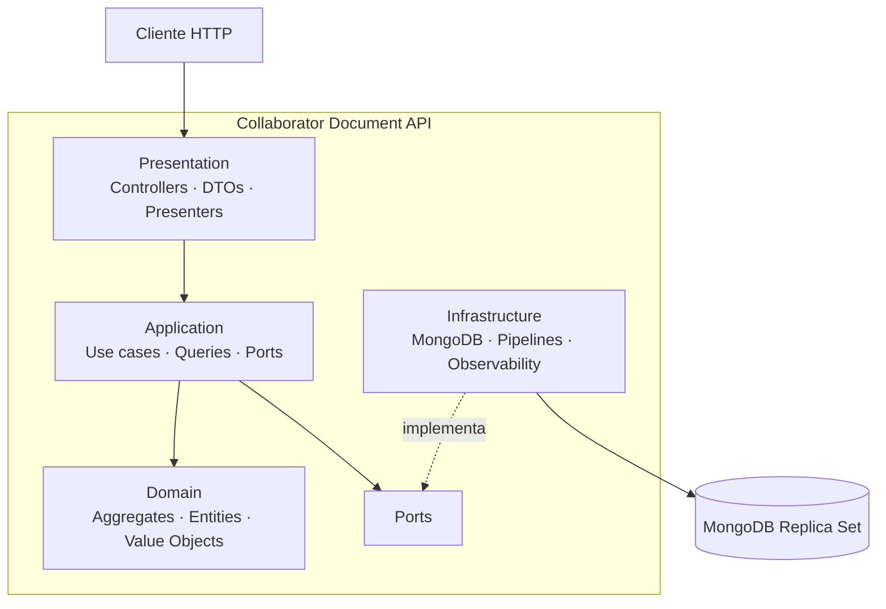
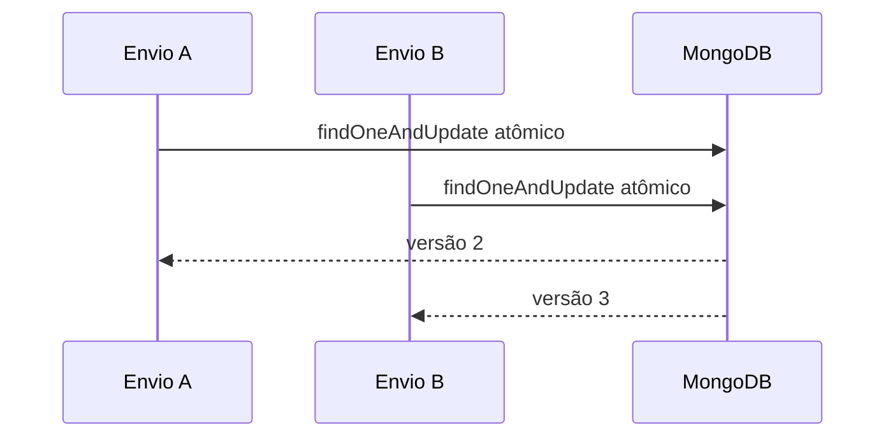

<div align="center">


[](https://git.io/typing-svg)

[](https://nodejs.org/)
[](https://www.typescriptlang.org/)
[](https://tsed.io/)
[](https://www.mongodb.com/)
[](https://spec.openapis.org/oas/v3.1.0)
[](https://stateless.group/hal_specification.html)

Uma API REST para administrar o ciclo documental de colaboradores: catálogo de tipos, vínculos obrigatórios, envios versionados, pendências e indicadores — sem apagar o contexto histórico.

[Portal](https://this-rafael.github.io/collaborator-api/) ·
[OpenAPI](https://this-rafael.github.io/collaborator-api/openapi/) ·
[TypeDoc](https://this-rafael.github.io/collaborator-api/reference/) ·
[Arquitetura](https://this-rafael.github.io/collaborator-api/architecture/)

</div>

---

## Conteúdo

- [O produto](#o-produto)
- [Capacidades](#capacidades)
- [Fluxo documental](#fluxo-documental)
- [Contratos HTTP](#contratos-http)
- [Arquitetura](#arquitetura)
- [Consistência e concorrência](#consistência-e-concorrência)
- [Execução local](#execução-local)
- [Qualidade](#qualidade)
- [Portal de documentação](#portal-de-documentação)

## O produto

A Collaborator Document API trata documentos como ciclos versionados, não como arquivos substituíveis. Um vínculo entre colaborador e tipo documental começa pendente, recebe versões sequenciais e pode ser encerrado sem perder os envios anteriores.

O armazenamento binário não faz parte do escopo. Cada versão registra metadados lógicos como nome original, tipo MIME, tamanho, chave de armazenamento, observações e instante de envio.

As decisões centrais são visíveis no próprio comportamento da API:

- representações de sucesso usam `application/hal+json`;
- falhas usam `application/problem+json` com código estável e `traceId`;
- exclusões são lógicas e preservam leitura histórica;
- vínculos encerrados não são reabertos: uma revinculação cria um novo ciclo;
- paginação usa cursor assinado e ordenação determinística;
- GETs funcionais oferecem ETag semântico;
- health checks ficam fora das regras funcionais de HAL, cache e rate limit.

## Capacidades

| Área              | O que a API oferece                                                                 |
| ----------------- | ----------------------------------------------------------------------------------- |
| Colaboradores     | Criação, consulta, alteração, listagem por cursor e soft delete                     |
| Tipos documentais | Catálogo extensível com código único, nome e descrição                              |
| Vínculos          | Associação entre colaborador e tipo, consulta histórica, desvinculação e novo ciclo |
| Versões           | Primeiro envio, reenvios, versão atual e histórico completo                         |
| Pendências        | Busca combinada por colaborador, CPF, tipo, código e paginação estável              |
| Indicadores       | Completude global e ranking de tipos documentais pendentes                          |
| Submissões        | Último envio de cada vínculo e linha do tempo de todos os eventos                   |
| Operação          | Descoberta HAL, liveness, readiness, rate limit, logs e rastreabilidade             |

## Fluxo documental



### Invariantes

```text
PENDING
├── currentVersion = 0
├── versions = []
└── lastSubmittedAt = null

SUBMITTED
├── currentVersion > 0
├── versions contém currentVersion
└── lastSubmittedAt != null
```

Um vínculo está ativo quando `deletedAt = null` e `unlinkedAt = null`. Uma versão nunca recebe `isActive`: a versão vigente é determinada por `currentVersion`.

## Contratos HTTP

A superfície pública tem 23 operações de negócio sob `/api/v1` e dois endpoints operacionais de saúde.

| Recurso           | Rotas principais                                                                            |
| ----------------- | ------------------------------------------------------------------------------------------- |
| Descoberta        | `GET /api/v1`                                                                               |
| Colaboradores     | `POST/GET /api/v1/collaborators`, `GET/PATCH/DELETE /api/v1/collaborators/{id}`             |
| Tipos documentais | `POST/GET /api/v1/document-types`, `GET/PATCH/DELETE /api/v1/document-types/{id}`           |
| Vínculos          | `POST/GET /api/v1/collaborator-documents`, `GET/DELETE /api/v1/collaborator-documents/{id}` |
| Versões           | `POST/GET /api/v1/collaborator-documents/{id}/versions`, `GET .../{version}`                |
| Pendências        | `GET /api/v1/pending-documents`                                                             |
| Estatísticas      | `GET /api/v1/statistics/completeness`, `GET /api/v1/statistics/pending-document-types`      |
| Submissões        | `GET /api/v1/submissions/latest`, `GET /api/v1/submission-events`                           |
| Saúde             | `GET /health/live`, `GET /health/ready`                                                     |

### Descoberta por links

```http
GET /api/v1 HTTP/1.1
Accept: application/hal+json
```

```json
{
  "name": "Collaborator Document API",
  "version": "1",
  "_links": {
    "self": { "href": "/api/v1" },
    "collaborators": {
      "href": "/api/v1/collaborators{?cursor,limit,name,cpf,email}",
      "templated": true
    },
    "document-types": {
      "href": "/api/v1/document-types{?cursor,limit,name,code}",
      "templated": true
    }
  }
}
```

A presença de um link comunica que a navegação ou transição está disponível no estado atual. Clientes não precisam reconstruir URLs nem oferecer ações ausentes da representação.

### Erros previsíveis

```json
{
  "type": "https://api.example.com/problems/duplicate-active-cpf",
  "title": "CPF já cadastrado",
  "status": 409,
  "detail": "Já existe um colaborador ativo com o CPF informado.",
  "instance": "/api/v1/collaborators",
  "code": "DUPLICATE_ACTIVE_CPF",
  "traceId": "01J3Y2QHB8FV4RGY7Y1QXNT2D4"
}
```

O contrato navegável com schemas, parâmetros, respostas e exemplos está no [portal OpenAPI](https://this-rafael.github.io/collaborator-api/openapi/).

## Arquitetura

O código é organizado como monólito modular com domínio isolado de HTTP e persistência. A camada de aplicação coordena casos de uso por portas; adaptadores MongoDB e controladores Ts.ED ficam nas bordas.



| Módulo                   | Responsabilidade                                                  |
| ------------------------ | ----------------------------------------------------------------- |
| `collaborators`          | Cadastro, atualização e exclusão lógica de colaboradores          |
| `document-types`         | Catálogo e ciclo de vida dos tipos documentais                    |
| `collaborator-documents` | Vínculos, versões, desvinculação e preservação histórica          |
| `reporting`              | Pendências, completude, rankings e eventos de submissão           |
| `shared`                 | Paginação, cache, erros, transações, segurança e HTTP transversal |

Explore 75 nós, 93 relações e sete camadas no [grafo interativo de arquitetura](https://this-rafael.github.io/collaborator-api/architecture/).

## Consistência e concorrência

### Versionamento atômico

O envio de versão é deliberadamente não idempotente: cada requisição aceita representa um novo evento. A persistência usa uma única atualização atômica para incrementar `currentVersion`, anexar a versão e atualizar status e timestamps.



Dois reenvios simultâneos produzem números distintos e sequenciais, sem sobrescrita.

### Soft delete transacional

Excluir um colaborador ou tipo documental propaga a exclusão lógica aos vínculos relacionados dentro da mesma transação. Isso exige MongoDB em replica set, com leitura no primário e confirmações compatíveis com atomicidade multi-documento.

Índices únicos parciais protegem CPF, e-mail, código documental e a combinação ativa de colaborador com tipo.

## Execução local

Requisitos:

- Node.js 24;
- pnpm 11.9 ou superior;
- Docker ou Podman compatível com Compose;
- MongoDB 7 em replica set, fornecido pelo ambiente Compose.

```bash
cd collaborator-document-api
cp .env.example .env
docker compose up -d mongodb
pnpm install --frozen-lockfile
pnpm dev
```

A API inicia em `http://localhost:3000`; a descoberta fica em `http://localhost:3000/api/v1`.

## Qualidade

O gate `verify` encadeia verificação de runtime, formatação, lint, typecheck, build, autocheck do test runner, cobertura e smoke test do artefato compilado.

```bash
cd collaborator-document-api
pnpm verify
```

As suítes cobrem quatro níveis:

- unitário: domínio, casos de uso, mapeadores, pipelines e infraestrutura isolada;
- HTTP: status, headers, media types e serialização;
- contrato: compatibilidade entre endpoints e OpenAPI;
- integração: índices, transações, concorrência e consultas reais no MongoDB.

O lint do contrato público e o build completo do portal também são executáveis localmente:

```bash
pnpm install --frozen-lockfile
npm run openapi:lint
npm run docs:site:check
```

## Portal de documentação

O portal é gerado de forma reproduzível e publicado pelo GitHub Pages quando `main` recebe alterações.

| Visão       | Conteúdo                                          | Link                                                                  |
| ----------- | ------------------------------------------------- | --------------------------------------------------------------------- |
| Hub         | Entrada bilíngue em português e inglês            | [Abrir](https://this-rafael.github.io/collaborator-api/)              |
| OpenAPI     | Contrato Redoc com exemplos HAL e Problem Details | [Abrir](https://this-rafael.github.io/collaborator-api/openapi/)      |
| TypeDoc     | Referência navegável dos símbolos TypeScript      | [Abrir](https://this-rafael.github.io/collaborator-api/reference/)    |
| Arquitetura | Grafo de conhecimento interativo em português     | [Abrir](https://this-rafael.github.io/collaborator-api/architecture/) |

---

<div align="center">

**Collaborator Document API** · histórico explícito, transições navegáveis e consistência verificável.

[GitHub](https://github.com/this-rafael/collaborator-api) · [Documentação](https://this-rafael.github.io/collaborator-api/)

</div>
