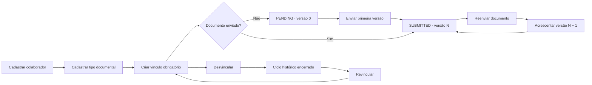
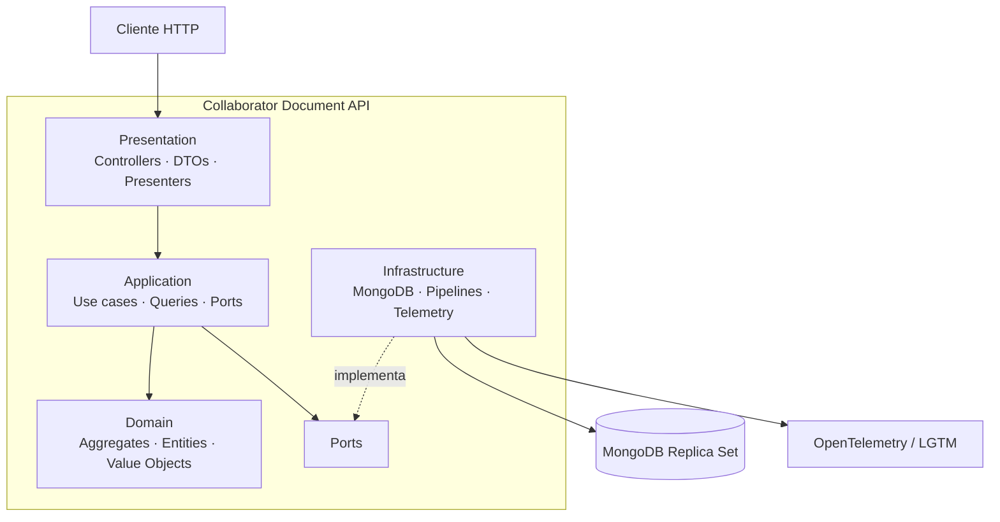
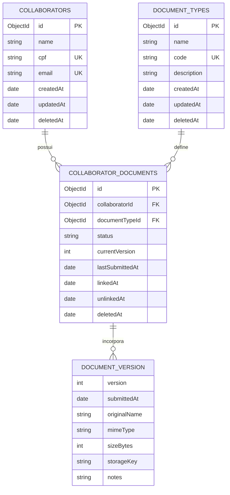
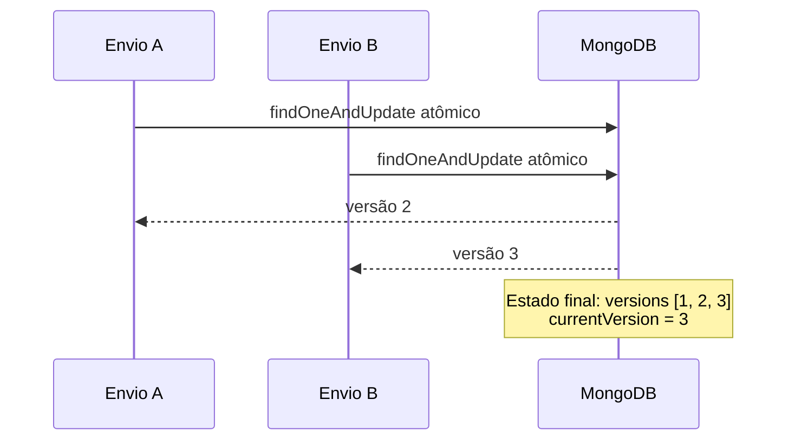
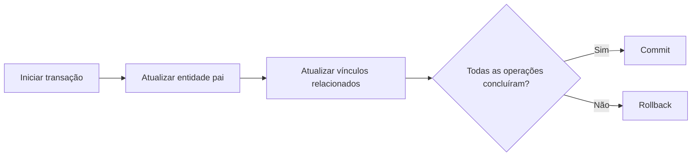

<div align="center">

# Collaborator Document API

### Gestão documental com histórico, consistência transacional e contratos HTTP explícitos.

Uma API REST para administrar colaboradores, tipos de documento, vínculos obrigatórios, envios versionados, pendências e indicadores globais — preservando histórico mesmo sob exclusões lógicas e reenvios concorrentes.

<p>
  
  
  
  
  
  
  
</p>

**[Visão geral](#visão-geral)** · **[Arquitetura](#arquitetura)** · **[API](#superfície-http)** · **[Execução](#execução-local)** · **[Testes](#estratégia-de-testes)** · **[Decisões](#decisões-de-produção)**

</div>

---

## Visão geral

A **Collaborator Document API** resolve o ciclo documental de colaboradores sem reduzir o problema a um CRUD simples.

Ela mantém o catálogo de documentos obrigatórios, registra os ciclos de vínculo entre colaborador e tipo documental, aceita envios e reenvios lógicos, preserva todas as versões anteriores e disponibiliza consultas operacionais para pendências e completude.

O projeto foi desenhado para demonstrar critérios de código pronto para produção:

- domínio independente de framework e persistência;
- contratos HTTP verificáveis por OpenAPI;
- histórico preservado por soft delete;
- versionamento seguro sob concorrência;
- cascatas multi-documento atômicas;
- paginação estável por cursor assinado;
- erros padronizados com Problem Details;
- HATEOAS para comunicar transições disponíveis;
- observabilidade, health checks e rate limit;
- testes unitários, integrados, de contrato, transação e concorrência.

> O armazenamento físico dos arquivos não faz parte do escopo. Cada envio representa metadados lógicos de uma versão documental.

---

## O problema que a API evita

Uma implementação ingênua desse domínio pode produzir estados silenciosamente incorretos:

- dois vínculos ativos para o mesmo colaborador e tipo;
- números de versão duplicados em reenvios simultâneos;
- perda de histórico ao substituir um documento;
- cascatas parcialmente persistidas em exclusões;
- registros removidos contaminando pendências e estatísticas;
- paginação que repete ou ignora itens;
- retries de envio interpretados incorretamente como idempotentes;
- erros HTTP inconsistentes entre endpoints;
- dados pessoais expostos em logs.

A arquitetura concentra essas restrições em invariantes de domínio, índices, operações atômicas e contratos explícitos.

---

## Capacidades

| Área | Capacidade |
|---|---|
| Colaboradores | Criar, listar, consultar, alterar e excluir logicamente |
| Tipos documentais | Manter catálogo extensível com código estável e descrição opcional |
| Vínculos | Vincular, consultar, listar, desvincular e iniciar novos ciclos documentais |
| Versões | Registrar primeiro envio, reenvios, histórico completo e versão atual |
| Pendências | Filtrar documentos pendentes por colaborador e tipo documental |
| Estatísticas | Calcular completude global e tipos mais frequentemente pendentes |
| Submissões | Consultar último envio por documento lógico e todos os eventos históricos |
| Descoberta | Navegar pela API usando representações HAL |
| Operação | Liveness, readiness, logs, métricas, tracing e rate limit |

---

## Fluxo principal



A revinculação não restaura o vínculo anterior. Ela cria um novo documento lógico para impedir que versões de ciclos distintos sejam misturadas.

---

## Arquitetura

O sistema utiliza um **monólito modular**, com **Arquitetura Hexagonal**, **DDD pragmático** e separação explícita entre escrita transacional e consultas projetadas.



### Módulos

| Módulo | Responsabilidade |
|---|---|
| `collaborators` | Cadastro, atualização e soft delete de colaboradores |
| `document-types` | Catálogo e lifecycle de tipos documentais |
| `collaborator-documents` | Vínculos, desvinculação, ciclos e histórico de versões |
| `reporting` | Pendências, completude, rankings e eventos de submissão |
| `shared` | Paginação, erros, transações, cache, segurança e HTTP transversal |

### Regras de dependência

```text
domain         -> não conhece Ts.ED, MongoDB, HTTP ou logging
application    -> conhece domínio e depende de portas abstratas
infrastructure -> implementa repositórios, transações e read models
presentation   -> converte HTTP em comandos/consultas e representações
reporting      -> consulta MongoDB por projeções, sem hidratar agregados
```

Nenhum módulo acessa diretamente a infraestrutura interna de outro módulo. A colaboração acontece por portas ou contratos públicos da aplicação.

<details>
<summary><strong>Estrutura recomendada do repositório</strong></summary>

```text
src/
├── config/
├── shared/
│   ├── domain/
│   ├── application/
│   │   ├── pagination/
│   │   │   ├── cursor-codec.ts
│   │   │   └── cursor-context.ts
│   │   └── transaction/
│   ├── infrastructure/
│   │   ├── persistence/mongodb/
│   │   ├── observability/
│   │   └── security/hmac-cursor-codec.ts
│   └── presentation/http/
│       ├── cache/etag.service.ts
│       ├── controllers/
│       ├── errors/
│       └── middlewares/rate-limit.middleware.ts
├── modules/
│   ├── collaborators/
│   ├── document-types/
│   ├── collaborator-documents/
│   └── reporting/
└── server.ts

tests/
├── unit/
├── integration/
│   ├── persistence/
│   ├── transactions/
│   └── api/
├── contract/
├── fixtures/
└── helpers/

docs/
├── architecture.md
├── data-model.md
├── openapi/
└── adr/

scripts/
├── init-replica-set.ts
├── create-indexes.ts
└── seed.ts
```

</details>

---

## Modelo de dados

O modelo usa três coleções principais. As versões são subdocumentos embutidos no documento de vínculo.



### Estado de um vínculo documental

```text
PENDING
├── currentVersion = 0
├── versions = []
└── lastSubmittedAt = null

SUBMITTED
├── currentVersion > 0
├── versions contém currentVersion
└── lastSubmittedAt != null
```

A versão ativa é derivada por `versions.version = currentVersion`. Não existe `isActive` nas versões.

### Estado ativo

```text
Colaborador ou tipo ativo:
  deletedAt = null

Vínculo ativo:
  deletedAt = null
  AND unlinkedAt = null
```

### Índices que protegem invariantes

| Coleção | Índice | Objetivo |
|---|---|---|
| `collaborators` | `cpf` único parcial | CPF único entre colaboradores ativos |
| `collaborators` | `email` único parcial | E-mail único entre colaboradores ativos |
| `document_types` | `code` único parcial | Código único entre tipos ativos |
| `collaborator_documents` | `collaboratorId + documentTypeId` único parcial | Um único vínculo ativo por combinação |
| `collaborator_documents` | `status + documentTypeId + collaboratorId + _id` | Pendências e paginação determinística |
| `collaborator_documents` | `lastSubmittedAt DESC + _id DESC` | Últimos envios |

---

## Concorrência e versionamento

O envio de uma versão é deliberadamente **não idempotente**. Cada requisição aceita representa um novo evento documental.

O número da versão nunca é calculado em memória.

```text
Proibido:
  ler currentVersion
  calcular currentVersion + 1 na aplicação
  executar update
```

Esse fluxo cria condição de corrida. A persistência deve usar um único `findOneAndUpdate` com update pipeline para:

1. incrementar `currentVersion`;
2. acrescentar a versão ao array;
3. atualizar `status` e timestamps;
4. retornar o documento atualizado.



Dois reenvios simultâneos são válidos e devem gerar versões sequenciais distintas, sem sobrescrita ou perda.

> Um retry após resposta incerta pode criar outra versão. A API não oferece `Idempotency-Key` neste escopo.

---

## Soft delete e atomicidade

Nenhum colaborador, tipo documental, vínculo ou versão é removido fisicamente.

A exclusão lógica de um colaborador ou tipo documental precisa propagar o estado aos vínculos relacionados na mesma transação MongoDB.



Configuração transacional padrão:

```text
readPreference = primary
readConcern = snapshot
writeConcern = majority
maxCommitTimeMS = 5000
```

A política permite até três tentativas, com retry da transação completa para `TransientTransactionError` e retry do commit para `UnknownTransactionCommitResult`.

A exclusão repetida de colaboradores e tipos retorna `204` sem alterar o timestamp original ou repetir a cascata.

---

## Superfície HTTP

A API possui **23 operações funcionais** sob `/api/v1` e dois endpoints operacionais de saúde fora dessa base.

### Discovery

| Método | Rota | Operação |
|---|---|---|
| `GET` | `/api/v1` | Descobrir recursos e transições disponíveis |

### Colaboradores

| Método | Rota | Operação |
|---|---|---|
| `POST` | `/api/v1/collaborators` | Criar colaborador |
| `GET` | `/api/v1/collaborators` | Listar colaboradores ativos |
| `GET` | `/api/v1/collaborators/{id}` | Consultar colaborador |
| `PATCH` | `/api/v1/collaborators/{id}` | Alterar colaborador ativo |
| `DELETE` | `/api/v1/collaborators/{id}` | Excluir colaborador logicamente |

### Tipos documentais

| Método | Rota | Operação |
|---|---|---|
| `POST` | `/api/v1/document-types` | Criar tipo documental |
| `GET` | `/api/v1/document-types` | Listar tipos ativos |
| `GET` | `/api/v1/document-types/{id}` | Consultar tipo documental |
| `PATCH` | `/api/v1/document-types/{id}` | Alterar tipo ativo |
| `DELETE` | `/api/v1/document-types/{id}` | Excluir tipo logicamente |

### Vínculos e versões

| Método | Rota | Operação |
|---|---|---|
| `POST` | `/api/v1/collaborator-documents` | Criar vínculo documental |
| `GET` | `/api/v1/collaborator-documents` | Listar vínculos |
| `GET` | `/api/v1/collaborator-documents/{id}` | Consultar vínculo |
| `DELETE` | `/api/v1/collaborator-documents/{id}` | Desvincular documento |
| `POST` | `/api/v1/collaborator-documents/{id}/versions` | Enviar ou reenviar versão |
| `GET` | `/api/v1/collaborator-documents/{id}/versions` | Listar versões |
| `GET` | `/api/v1/collaborator-documents/{id}/versions/{version}` | Consultar versão específica |

### Consultas e estatísticas

| Método | Rota | Operação |
|---|---|---|
| `GET` | `/api/v1/pending-documents` | Listar documentos pendentes |
| `GET` | `/api/v1/statistics/completeness` | Consultar completude global |
| `GET` | `/api/v1/statistics/pending-document-types` | Listar tipos com mais pendências |
| `GET` | `/api/v1/submissions/latest` | Consultar último envio por documento lógico |
| `GET` | `/api/v1/submission-events` | Consultar todos os eventos de envio |

### Operação

| Método | Rota | Comportamento |
|---|---|---|
| `GET` | `/health/live` | Verifica apenas se o processo está operacional |
| `GET` | `/health/ready` | Verifica MongoDB e capacidade de atender requisições |

Health checks não usam HAL, ETag ou rate limit.

---

## Contrato de representação

### Sucesso: HAL

Respostas funcionais de sucesso usam `application/hal+json`.

```json
{
  "id": "66a64ab05bd7213b90d9b001",
  "name": "Ana Souza",
  "cpf": "12345678909",
  "email": "ana.souza@example.com",
  "deletedAt": null,
  "_links": {
    "self": {
      "href": "/api/v1/collaborators/66a64ab05bd7213b90d9b001"
    },
    "update": {
      "href": "/api/v1/collaborators/66a64ab05bd7213b90d9b001",
      "method": "PATCH"
    },
    "delete": {
      "href": "/api/v1/collaborators/66a64ab05bd7213b90d9b001",
      "method": "DELETE"
    }
  }
}
```

A presença de um link comunica que a transição está disponível no estado atual. A ausência do link comunica que o cliente não deve oferecer a ação.

### Erros: Problem Details

Falhas usam `application/problem+json`.

```json
{
  "type": "https://api.example.com/problems/duplicate-active-cpf",
  "title": "CPF já cadastrado",
  "status": 409,
  "detail": "Já existe um colaborador ativo cadastrado com o CPF informado.",
  "instance": "/api/v1/collaborators",
  "code": "DUPLICATE_ACTIVE_CPF",
  "traceId": "01J3Y2QHB8FV4RGY7Y1QXNT2D4",
  "errors": [
    {
      "field": "cpf",
      "code": "DUPLICATE_ACTIVE_CPF",
      "message": "O CPF já pertence a outro colaborador ativo."
    }
  ]
}
```

### Classificação de falhas

| Situação | Status |
|---|---:|
| Entrada ou parâmetro inválido | `400` |
| Tipo de mídia não suportado | `415` |
| Regra semântica ou capacidade do histórico | `422` |
| Recurso inexistente | `404` |
| Recurso logicamente indisponível | `410` |
| Conflito de unicidade ou estado | `409` |
| Rate limit excedido | `429` |
| Dependência temporariamente indisponível | `503` |
| Falha interna inesperada | `500` |

Respostas `500` e `503` incluem `traceId`, mas nunca expõem stack trace, query, URI, credenciais ou mensagem do driver.

---

## Paginação, cache e limites

### Cursor assinado

Todas as coleções usam keyset pagination. `skip` e `offset` não fazem parte da estratégia.

O cursor é um envelope assinado contendo:

```text
version + issuedAt + expiresAt + operationId
+ filtros normalizados + ordenação + limit + posição
```

Regras:

- JSON canônico;
- `base64url`;
- HMAC-SHA-256;
- segredo mínimo de 32 bytes em `CURSOR_SIGNING_SECRET`;
- validade de 15 minutos;
- assinatura comparada em tempo constante;
- contexto vinculado à operação, filtros, ordenação e limite;
- `_id` como último critério de desempate.

Cursor adulterado, expirado ou reutilizado em outro contexto é rejeitado.

### ETag

Todos os `GET` funcionais aceitam `If-None-Match` e retornam ETag fraco:

```text
W/"sha256:<hash>"
```

O hash considera os dados semanticamente relevantes, os filtros e a página. Campos voláteis, como `calculatedAt` e `traceId`, não participam do cálculo.

Quando a representação não muda, a API retorna `304` sem corpo.

### Rate limit

| Categoria | Limite padrão |
|---|---:|
| `GET` funcional | 60 requisições por 60 segundos |
| `POST`, `PATCH`, `DELETE` | 20 requisições por 60 segundos |
| Health checks | Isentos |

O limite é local à instância, por IP e operação. `429` retorna `Retry-After` em segundos inteiros.

`trust proxy` permanece desabilitado por padrão e só pode ser ativado explicitamente.

---

## Consultas de reporting

### Completude global

```text
completude =
  vínculos ativos SUBMITTED
  / total de vínculos ativos
  * 100
```

- colaboradores sem vínculos não entram no denominador;
- sem vínculos ativos, o percentual é `0`;
- o resultado é arredondado para duas casas usando `HALF_UP`.

### Tipos mais pendentes

A consulta filtra vínculos ativos e pendentes, agrupa por tipo documental, conta ocorrências e ordena pela quantidade decrescente.

### Últimos envios

Retorna o envio mais recente de cada documento lógico, ordenado por `lastSubmittedAt DESC` com desempate determinístico.

### Eventos históricos

Executa `$unwind` no histórico embutido e ordena por `versions.submittedAt DESC`.

Reporting usa read models e aggregation pipelines dedicados. Ele não carrega agregados de escrita para produzir projeções.

---

## Execução local

### Pré-requisitos

- Node.js 24 LTS;
- Docker e Docker Compose;
- MongoDB executado como replica set;
- um segredo HMAC com pelo menos 32 bytes.

> Os artefatos de especificação não incluem o `package.json` nem o `docker-compose.yml` finais. Os comandos abaixo definem o contrato operacional recomendado para a implementação.

### Subir o ambiente completo

```bash
cp .env.example .env
docker compose up --build
```

A API utiliza por padrão:

```text
http://localhost:3000
```

### Desenvolvimento local

```bash
corepack enable
pnpm install
cp .env.example .env

docker compose up -d mongodb
pnpm dev
```

### Verificar saúde

```bash
curl http://localhost:3000/health/live
curl http://localhost:3000/health/ready
```

### Descobrir a API

```bash
curl \
  -H 'Accept: application/hal+json' \
  http://localhost:3000/api/v1
```

---

## Configuração

Exemplo de `.env` recomendado:

```dotenv
NODE_ENV=development
PORT=3000

MONGODB_URI=mongodb://localhost:27017/collaborator_documents?replicaSet=rs0

CURSOR_SIGNING_SECRET=replace-with-at-least-32-bytes
CURSOR_TTL_SECONDS=900

CORS_ALLOWED_ORIGINS=http://localhost
TRUST_PROXY=false

RATE_LIMIT_GET_MAX=60
RATE_LIMIT_WRITE_MAX=20
RATE_LIMIT_WINDOW_SECONDS=60

LOG_LEVEL=debug
```

A configuração final deve manter:

- CORS por allowlist;
- `*` proibido em ambiente tratado como produção;
- limites configuráveis por ambiente;
- relógio e segredo substituíveis nos testes;
- nenhuma credencial ou URI completa em logs.

---

## Exemplos de uso

### Criar colaborador

```bash
curl -X POST http://localhost:3000/api/v1/collaborators \
  -H 'Content-Type: application/json' \
  -H 'Accept: application/hal+json' \
  -d '{
    "name": "Ana Souza",
    "cpf": "12345678909",
    "email": "ana.souza@example.com"
  }'
```

### Criar tipo documental

```bash
curl -X POST http://localhost:3000/api/v1/document-types \
  -H 'Content-Type: application/json' \
  -H 'Accept: application/hal+json' \
  -d '{
    "name": "Atestado de Saúde Ocupacional",
    "code": "ASO",
    "description": "Documento ocupacional obrigatório"
  }'
```

### Vincular documento ao colaborador

```bash
curl -X POST http://localhost:3000/api/v1/collaborator-documents \
  -H 'Content-Type: application/json' \
  -H 'Accept: application/hal+json' \
  -d '{
    "collaboratorId": "66a64ab05bd7213b90d9b001",
    "documentTypeId": "66a64ab05bd7213b90d9b101"
  }'
```

### Enviar versão lógica

```bash
curl -X POST \
  http://localhost:3000/api/v1/collaborator-documents/66a64ab05bd7213b90d9b201/versions \
  -H 'Content-Type: application/json' \
  -H 'Accept: application/hal+json' \
  -d '{
    "metadata": {
      "originalName": "aso-ana-souza.pdf",
      "mimeType": "application/pdf",
      "sizeBytes": 184320,
      "storageKey": null,
      "notes": "Documento conferido"
    }
  }'
```

### Listar pendências

```bash
curl \
  -H 'Accept: application/hal+json' \
  'http://localhost:3000/api/v1/pending-documents?limit=20&documentTypeCode=ASO'
```

### Usar cache condicional

```bash
curl \
  -H 'Accept: application/hal+json' \
  -H 'If-None-Match: W/"sha256:<hash>"' \
  http://localhost:3000/api/v1/statistics/completeness
```

---

## Estratégia de testes

A estratégia cobre comportamento de domínio, persistência real e contrato HTTP.

| Camada | Ferramentas | Foco |
|---|---|---|
| Unitários | Vitest | Agregados, value objects, casos de uso e erros |
| Framework | Ts.ED PlatformTest | DI, controllers e lifecycle da aplicação |
| HTTP | Supertest | Status, headers, HAL, filtros e Problem Details |
| Persistência | Testcontainers MongoDB | Índices, pipelines e mapeamento |
| Transações | MongoDB replica set | Commit, rollback e retries |
| Concorrência | Requisições simultâneas | Sequenciamento sem perda de versões |
| Contrato | OpenAPI 3.1 | Compatibilidade entre implementação e especificação |
| BDD | Cenários executáveis | Regras funcionais e transversais |

### Casos críticos

- duplicidade de CPF, e-mail, código e vínculo ativo;
- primeiro envio e reenvio;
- dois reenvios simultâneos;
- retry de uma submissão não idempotente;
- rollback de cascata incompleta;
- retry transacional e esgotamento em `503`;
- cursor adulterado, expirado ou fora de contexto;
- mudança semântica de ETag;
- `304` sem corpo;
- exclusão lógica refletida em todas as estatísticas;
- readiness indisponível sem exposição de dados internos;
- crescimento do histórico e erro `DOCUMENT_HISTORY_LIMIT_REACHED`.

### Comandos propostos

```bash
pnpm test
pnpm test:unit
pnpm test:integration
pnpm test:contract
pnpm test:coverage
pnpm typecheck
pnpm lint
```

A baseline atual contém **382 cenários BDD**. As decisões normativas também exigem cenários adicionais para health checks, limite físico do histórico, contexto/expiração de cursor e retries transacionais.

---

## Observabilidade

A aplicação deve produzir logs estruturados, traces e métricas sem depender da disponibilidade da stack de observabilidade.

### Contexto mínimo por requisição

- `traceId` / request ID;
- método e rota normalizada;
- status e duração;
- `operationId`;
- resultado transacional, quando aplicável;
- erro normalizado sem conteúdo sensível.

CPF e e-mail devem ser mascarados em logs.

### Métricas mínimas

```text
http_server_requests_total
http_server_request_duration_ms
mongo_transaction_retries_total
document_version_submissions_total
document_version_submission_conflicts_total
rate_limit_rejections_total
```

### Stack local

- OpenTelemetry para instrumentação;
- Grafana para visualização;
- Loki para logs;
- Tempo para traces;
- Prometheus para métricas.

A indisponibilidade do ambiente LGTM não impede a inicialização da API.

---

## Decisões de produção

| Tema | Decisão | Motivo |
|---|---|---|
| Deploy | Monólito modular | Simplicidade operacional sem perder isolamento interno |
| Domínio | Hexagonal + DDD pragmático | Testabilidade e regras independentes de tecnologia |
| Banco | MongoDB replica set | Arrays embutidos, pipelines atômicos e transações |
| Versões | Embutidas no vínculo | Primeiro envio e reenvios em uma única operação atômica |
| Concorrência | Serialização pelo MongoDB | Aceitar todos os reenvios sem lock otimista |
| Soft delete | Cascata transacional | Consultas e estatísticas não carregam vínculos órfãos ativos |
| Reporting | CQRS-lite | Pipelines otimizados sem contaminar o domínio de escrita |
| Paginação | Cursor HMAC + keyset | Estabilidade, integridade e eficiência |
| Cache | ETag semântico fraco | Evitar respostas redundantes sem depender de timestamps voláteis |
| Erros | Problem Details | Contrato uniforme e observável |
| Navegação | HAL | Transições controladas pelo estado do recurso |
| Rate limit | Memória local | Proteção compatível com o escopo, com limitação declarada |
| Autenticação | Fora do escopo | Priorizar os requisitos avaliados pelo desafio |

---

## Limitações conhecidas

### Histórico embutido

O array `versions` cresce continuamente. A escolha favorece atomicidade e simplicidade, mas possui custos:

- crescimento do documento MongoDB;
- limite físico de capacidade do documento;
- `$unwind` em consultas globais de eventos;
- paginação de histórico menos simples.

A aplicação deve emitir advertência quando o documento ultrapassar **8 MiB** e mapear falhas de capacidade para:

```text
422 DOCUMENT_HISTORY_LIMIT_REACHED
```

A evolução natural é mover eventos de submissão para uma coleção própria quando o volume justificar a mudança.

### Rate limit local

O contador em memória não é compartilhado entre réplicas. Uma implantação distribuída deve migrar essa responsabilidade para um armazenamento comum ou gateway externo.

### Sem idempotência de envio

`POST /versions` registra um evento a cada aceitação. Clientes precisam tratar resposta incerta com cuidado.

### Sem autenticação

O contrato atual não possui `401`, `403`, identidade de usuário ou `submittedBy` confiável.

---

## Fora do escopo

- autenticação e autorização;
- upload ou armazenamento físico de arquivos;
- deduplicação por conteúdo;
- `Idempotency-Key`;
- hard delete;
- restauração de colaboradores ou tipos excluídos;
- restauração de vínculo encerrado;
- campo `active`, `isActive`, `required` ou `submittedBy`;
- rate limit distribuído;
- interface gráfica;
- migração das versões para coleção própria nesta entrega.

---

## Estado da especificação

O projeto possui definição suficiente para implementação integral, mas os artefatos fornecidos ainda registram uma sincronização documental pendente:

- o OpenAPI atual contém as 23 operações funcionais, mas ainda não contém `/health/live` e `/health/ready`;
- o plano BDD atual contém 382 cenários, mas ainda não contém os cenários adicionais exigidos pelas decisões normativas;
- o erro `DOCUMENT_HISTORY_LIMIT_REACHED` ainda precisa ser incorporado ao OpenAPI e ao BDD;
- a arquitetura precisa manter explícitos `getDocumentVersion`, `listSubmissionEvents`, cursor HMAC, ETag, rate limit e health controllers.

A implementação deve tratar as correções normativas como fonte prioritária e atualizar os contratos antes de considerar a entrega concluída.

---

## Definição de pronto

- [ ] 23 operações funcionais implementadas sem renomeação;
- [ ] health checks contratados e testados;
- [ ] OpenAPI, implementação e BDD sem divergências;
- [ ] MongoDB de teste executado como replica set;
- [ ] índices criados e verificados;
- [ ] submissão concorrente preservando todas as versões;
- [ ] cascatas de soft delete atômicas;
- [ ] cursor assinado, contextual e expirável;
- [ ] ETag semântico em todos os `GET` funcionais;
- [ ] HAL e Problem Details validados por contrato;
- [ ] logs sem CPF ou e-mail integral;
- [ ] testes unitários, integração, contrato, transação e concorrência aprovados;
- [ ] execução local reproduzível por containers;
- [ ] limitações e decisões relevantes documentadas.

---

## Licença

Este projeto foi definido para um teste técnico da Inmeta. Nenhuma licença open source foi estabelecida nos artefatos fornecidos.

---

<div align="center">

**Histórico não é detalhe de implementação. Consistência também faz parte do produto.**

</div>
